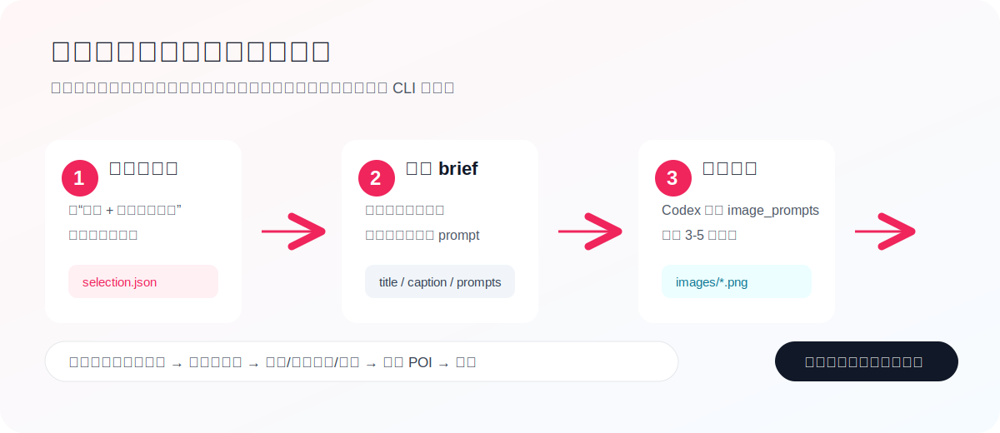
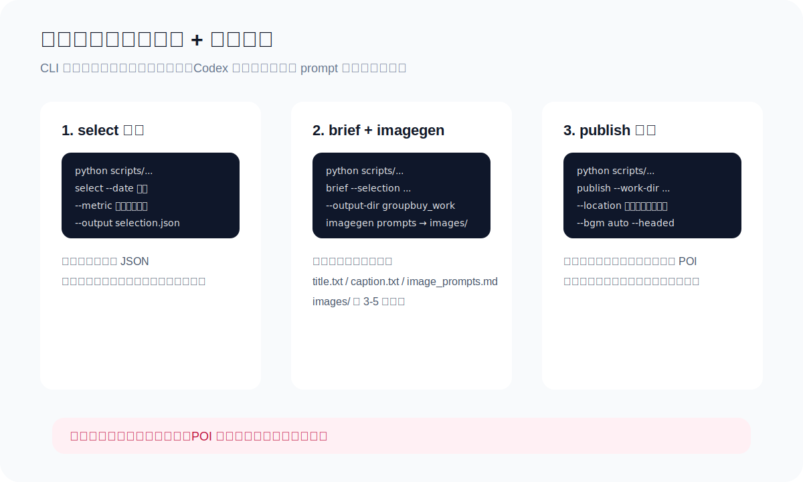
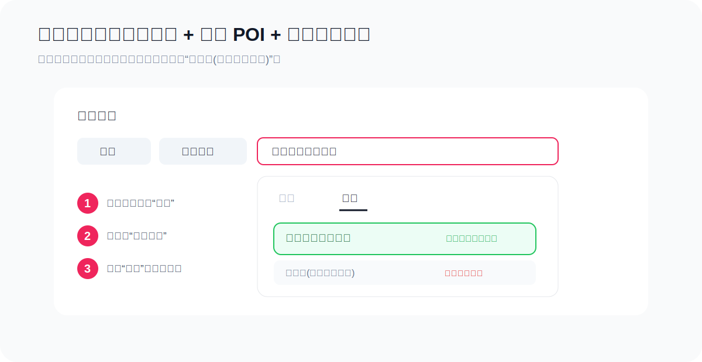
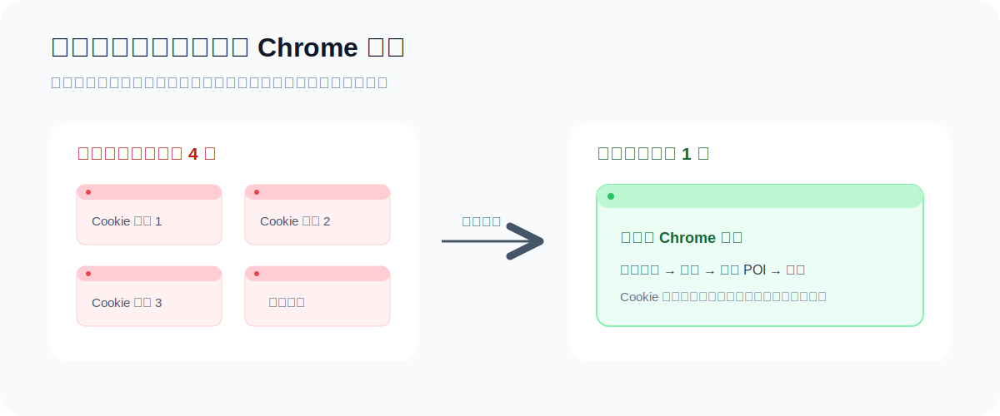

# 抖音团购选品图文/视频发布自动化


把抖音本地生活内容生产里最重复的操作串成一条命令链：

**生意经选品 → 查询商品详情 → 生成公开推广工作包 → 原生生图 → 发布图文或视频 → 挂国内团购位置。**



## 一眼看懂

| 你提供什么 | 脚本自动处理什么 | 最后得到什么 |
| --- | --- | --- |
| 抖音账号、来客主体和选品条件 | 从生意经读取排名商品，再查询商品详情 | `selection.json` |
| 选中的卡券和推广门店 | 生成标题、正文、图片提示词和发布元数据 | 一套公开推广工作包 |
| 3-5 张生图海报 | 上传图片、选择音乐、挂国内 POI | 抖音团购图文 |
| 一条已经生成的视频 | 填写标题简介、挂带货位置并发布 | 抖音团购视频 |

## 脚本能做什么

### 1. 从生意经选卡券

- 支持“昨天”“近 7 日”等时间条件。
- 支持按商品成交券数等指标取前 N 个商品。
- 获取商品 ID 后回到抖音来客商品管理查询详情。
- 内部数据只用于选品，不会自动写进公开推广文案。

### 2. 生成公开推广工作包

脚本会把商品信息整理成：

```text
groupbuy_work/
├── title.txt
├── caption.txt
├── image_prompts.md
├── publish_meta.json
└── images/
```

`image_prompts.md` 可直接交给 Codex 的 `imagegen` 技能，生成 3-5 张原生图片。脚本不会用 HTML 截图冒充生图。

### 3. 发布团购图文

- 上传 3-5 张图片。
- 按内容选择推荐音乐，或使用指定音乐。
- 填写标题、正文和话题。
- 挂“位置 + 带货模式 + 国内”门店 POI。
- 发布成功后进入作品管理页。

### 4. 发布团购视频

已经有 MP4 时，不需要重新走选品和生图。直接执行 `publish-video`：

```bash
./bin/douyin-groupbuy publish-video \
  --account likai_douyin_2 \
  --file /path/to/video.mp4 \
  --title "猛男被叫美女后，真香买了19.9逛吃卡" \
  --desc "中大银泰服务台短剧，19.9逛吃卡真香反转。" \
  --tags "杭州中大银泰,19块9逛吃卡,杭州团购,本地生活" \
  --location "杭州中大银泰百货" \
  --headed
```

这条命令会完成：上传视频、填写作品信息、选择国内门店位置、点击发布和检查成功状态。

## 命令和产物



常用入口只有四个：

| 命令 | 用途 |
| --- | --- |
| `select` | 从生意经选品并查询商品详情 |
| `brief` | 生成公开推广工作包 |
| `publish` | 发布团购图文并选择音乐 |
| `publish-video` | 发布团购视频并挂国内位置 |

## 团购位置不会只“输入”不“选择”

位置发布按固定顺序执行：

1. 添加标签选择“位置”。
2. 进入“带货模式”。
3. 切换到“国内”。
4. 输入完整门店名。
5. 等待候选加载。
6. 选择匹配的商场级候选。



候选项会按名称和门店类型评分。例如目标是“合肥滨湖银泰百货”时，商场级位置优先于“植村秀（滨湖银泰城店）”这类店铺级位置。

## 一次发布只启动一个浏览器

旧流程会在正式上传前最多启动 3 次 Chrome 检查 Cookie，真正上传时再启动一次。现在登录校验、上传、位置选择和发布共用同一个浏览器会话。



Cookie 失效时，命令会提示重新登录，不会继续打开多个窗口。正常发布也不需要每次先运行 `douyin check`。

## 安装

```bash
git clone https://github.com/784697524-ux/douyin-groupbuy-auto-publish.git
cd douyin-groupbuy-auto-publish
./install.sh
./scripts/apply_douyin_groupbuy_patch.sh
```

默认使用本机运行环境：

```text
$HOME/.openclaw/workspace/social-auto-upload
```

运行环境不在默认目录时：

```bash
export SOCIAL_AUTO_UPLOAD_HOME="/path/to/social-auto-upload"
./scripts/apply_douyin_groupbuy_patch.sh
```

## 从选品到图文发布

### 第一步：选取昨日卡券

```bash
python scripts/douyin_groupbuy_pipeline.py select \
  --account likai_douyin_2 \
  --groupid 1748531528342532 \
  --date "昨天" \
  --metric "商品成交券数" \
  --limit 3 \
  --output /path/to/selection.json \
  --headed
```

如果需要复用已经登录的 Chrome：

```bash
python scripts/douyin_groupbuy_pipeline.py select \
  --account likai_douyin_2 \
  --groupid 1748531528342532 \
  --date "昨天" \
  --metric "商品成交券数" \
  --limit 3 \
  --output /path/to/selection.json \
  --cdp-url http://127.0.0.1:9222 \
  --headed
```

### 第二步：生成推广工作包

```bash
python scripts/douyin_groupbuy_pipeline.py brief \
  --selection /path/to/selection.json \
  --product-index 1 \
  --output-dir /path/to/groupbuy_work \
  --location "合肥滨湖银泰百货"
```

读取 `/path/to/groupbuy_work/image_prompts.md`，调用 Codex 原生生图，并将图片放入：

```text
/path/to/groupbuy_work/images/
```

### 第三步：发布图文

```bash
python scripts/douyin_groupbuy_pipeline.py publish \
  --account likai_douyin_2 \
  --work-dir /path/to/groupbuy_work \
  --location "合肥滨湖银泰百货" \
  --bgm auto \
  --headed
```

## 成功标准

任务只有满足下面条件才算完成：

- 选品：`selection.json` 包含排名商品和商品详情。
- 内容：工作目录包含标题、正文、图片提示词和发布元数据。
- 位置：日志确认选中了目标商场级 POI，而不是只在输入框里写了名称。
- 发布：页面进入作品管理页，或出现平台明确的发布成功状态。

短信验证码、图形验证码、位置候选错误、只完成上传，都不能算发布成功。

## 公开内容边界

仓库和公开文案不会包含：

- 抖音 Cookie、二维码、账号密码和浏览器 Profile。
- 商品 ID、后台销量、成交金额和内部排名。
- 发布日志和带个人信息的后台截图。

对外内容只使用消费者能够看到的商品权益、售价、使用日期、适用门店和退款规则。

## 更多说明

- [完整使用说明](references/usage.md)
- [音乐和位置选择器说明](references/automa-selectors.md)
- [公开推广文案规则](references/public-copy-rules.md)
